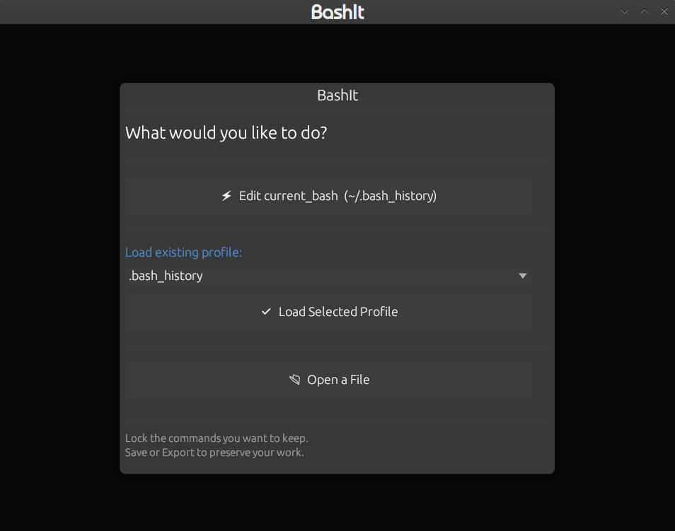
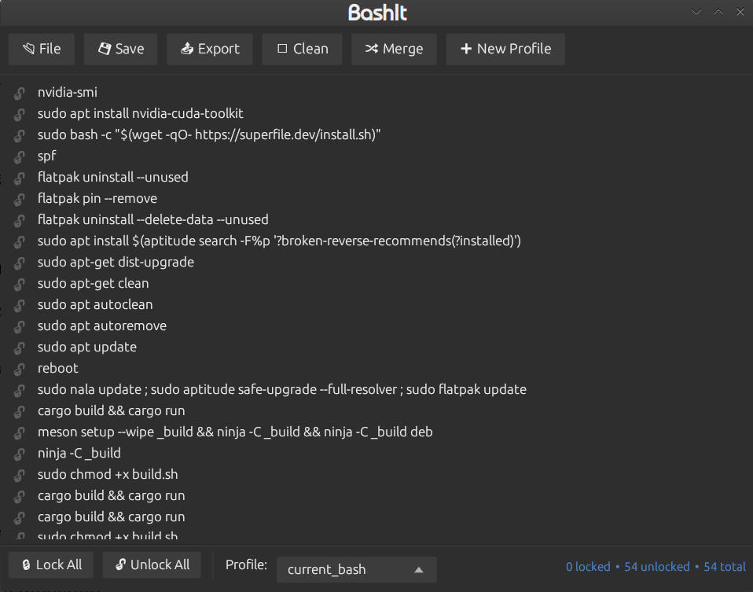

# BashIt

A bash command file curator and profile manager. BashIt opens any line-based
bash-compatible file — history files, scripts, command lists — presents the
contents as a manageable list, and lets you lock commands for retention and
export.

The lock is the only selection mechanism. Locked = keep. Unlocked = removed on
clean, not exported. No checkboxes, no ambiguity.

---

```
Developer:  archerprojects
Contact:    archer.projects@proton.me
Maintainer: archerprojects <archer.projects@proton.me>
GitHub:     https://github.com/archerprojects/bashit
```

Developed for Lean Linux. Not exclusive to Lean Linux — runs on any standard
Linux desktop.

---

## Features

- Opens the live `~/.bash_history` or any bash-compatible file
- Lock commands to keep them; unlocked commands are dropped on clean
- Named profiles for different command sets, with per-profile lock state
- Merge command sets together; export a curated set back to `~/.bash_history`
- Automatic timestamped backups before any destructive operation
- Light/dark theming that follows the system setting at runtime

---

## Screenshots


*On launch — choose to edit the live session, load a profile, or open a file.*


*The main list — lock what you want to keep, clean the rest.*

---

## Prerequisites

### Runtime

BashIt is a single self-contained binary. It needs a graphical desktop and the
following shared libraries, which are present on any standard desktop install
and are declared in the package so `apt` will pull them if missing:

- OpenGL (`libgl1`)
- X11 / XCB (`libxcb1`, `libxcb-render0`, `libxcb-shape0`, `libxcb-xfixes0`)
- Keyboard handling (`libxkbcommon0`)
- C runtime (`libc6`, `libgcc-s1`)

### Build

- Rust stable 1.77 or newer
- `dpkg-deb` (from the `dpkg` package) to build the `.deb`

---

## Building

From the project root:

```bash
./build.sh
```

`build.sh` compiles a release binary, stages the package tree, and writes the
`.deb` to `dist/`. The version is managed manually in `Cargo.toml` — bump it
there before running a release build.

## Installing

```bash
sudo dpkg -i dist/bashit_*.deb
sudo apt-get install -f -y    # resolve dependencies if needed
```

To remove:

```bash
sudo apt purge bashit --autoremove
```

---

## Storage

BashIt keeps its data under `~/.bhistory/`:

```
~/.bhistory/
    profiles/    named profiles (.hist commands + .json lock state)
    backups/     timestamped backups taken before destructive operations
```

The live view always reads `~/.bash_history` directly.

---

## Compatibility

Tested on Ubuntu 24.04. The package is built for `amd64`.

---

## License

Licensed under the GNU General Public License v3.0 or later
(`GPL-3.0-or-later`). See [LICENSE](LICENSE) for the full text.

Copyright (C) 2026 archerprojects (archer.projects@proton.me)
